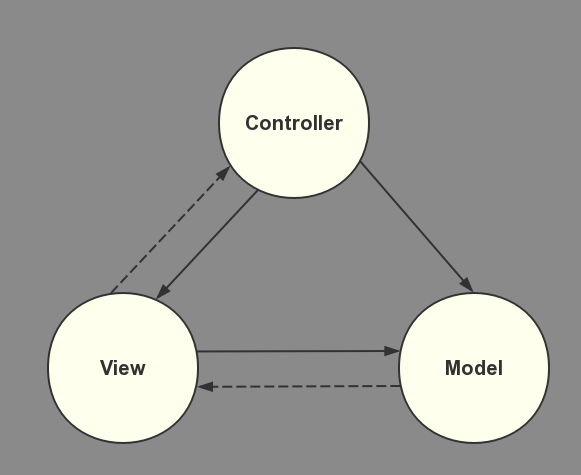
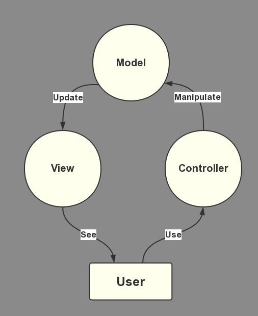

一种架构模式，分为三部分：

- M（Model）—— 程序员编写程序应有的功能（实现算法等等）、数据库专家进行数据管理和数据库设计(可以实现具体的功能)
- V（View）—— 界面设计人员进行图形界面设计
- C（Controller）—— 负责转发请求，对请求进行处理



组件间的合作



### Model（模型）

用于封装与应用程序的业务逻辑相关的数据以及对数据的处理方法。`Model` 有对数据直接访问的权力，例如对数据库的访问。`Model` 不依赖 `View` 和`Controller`，也就是说，`Model` 不关心它会被如何显示或是如何被操作。但是 `Model` 中数据的变化一般会通过一种刷新机制被公布。为了实现这种机制，那些用于监视此 `Model` 的 `View` 必须事先在此 `Model` 上注册，从而，`View` 可以了解在数据 `Model` 上发生的改变

#### 前端

正如 React-Native 中 Realm 的使用，你需要先定义数据的 `Model`

```js
import realm from 'realm';

const UserSchema = {
  name: "User",
  properties: {
    name: "string",
    age: "int",
    email: "string",
    phone: "string"
  }
}

// 在 Realm 中注册一个 UserSchema 的 Model
realm.open({ schema: [ UserSchema ] })
```

在存储数据的时候，需要将数据转换成 User 的 model 形式，再将其存入 Realm 中

```javascript
let user = {
  name: "Dwyane",
  age: 22,
  email: "dwyane@gmail.com",
  phone: "18888888888"
}

Realm.then(realm => {
  realm.write(() => {
    realm.create("User", user)
  })
})
```

#### 后台

下面是 **Beego** 的典型目录结构（摘自谢大的 [Beego](https://beego.me/docs/intro/)）

```
├── conf
│   └── app.conf
├── controllers     // Controller
│   ├── admin
│   └── default.go
├── main.go
├── models          // Model
│   └── models.go
├── static          // View
│   ├── css
│   ├── ico
│   ├── img
│   └── js
└── views
    ├── admin
    └── index.tpl
```

上面的两个文件夹 `controllers` 、`models` 和 `static` 就分别是 MVC 中的 `Controller` 、`Model` 和 `View`，而这边的 `models` 中的文件负责的就是与数据库的交互工作

而阿里的开源框架 **Egg.js** 也有对应的 `Model` 和 `Controller`，如下是其目录结构（摘自 [Egg.js](https://eggjs.org/zh-cn/basics/structure.html)）

```
egg-project
├── package.json
├── app.js (optional)
├── agent.js (optional)
├── app
|   ├── router.js
│   ├── controller          // Controller
│   |   └── home.js
│   ├── service (optional)  // Model
│   |   └── user.js
│   ├── middleware (optional)
│   |   └── response_time.js
│   ├── schedule (optional)
│   |   └── my_task.js
│   ├── public (optional)
│   |   └── reset.css
│   ├── view (optional)     // View
│   |   └── home.tpl
│   └── extend (optional)
│       ├── helper.js (optional)
│       ├── request.js (optional)
│       ├── response.js (optional)
│       ├── context.js (optional)
│       ├── application.js (optional)
│       └── agent.js (optional)
├── config
|   ├── plugin.js
|   ├── config.default.js
│   ├── config.prod.js
|   ├── config.test.js (optional)
|   ├── config.local.js (optional)
|   └── config.unittest.js (optional)
└── test
    ├── middleware
    |   └── response_time.test.js
    └── controller
        └── home.test.js
```

上面的三个文件夹 `controller` 、`service` 和 `view` 就分别是 MVC 中的 `Controller` 、`Model` 和 `View`，而这边的 `service` 中的文件负责的就是与数据库的交互工作

### 视图（View）

数据的展示以及用户的操作界面，如上面的 Beego 目录结构中的 `static` 和 Egg.js 目录结构中的 `view`，但一般情况下，`View` 部分还是由前端开发人员负责

###控制器（Controller）

起到不同层面间的组织作用，用于控制应用程序的流程。它处理事件并作出响应，负责请求的转发，将 `View` 的请求发送给 `Model`，并将 `Model` 返回的数据发送给 `View`

### 参考

- [浅谈 MVC、MVP 和 MVVM 架构模式](https://draveness.me/mvx)
