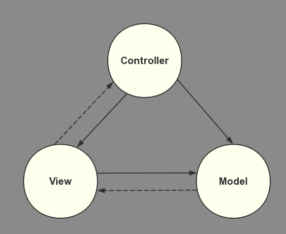

### MVC（Model-View-Controller）

Model 负责数据的处理，View 负责用户界面，Controller 负责业务逻辑

### MVP（Model-View-Presenter）

MVP 模式将 Controller 改名为 Presenter，同时改变了通信方向

- 各部分之间的通信，都是双向的
- View 与 Model 不发生联系，都通过 Presenter 传递
- View 非常薄，不部署任何业务逻辑，称为"被动视图"（Passive View），即没有任何主动性，而 Presenter非常厚，所有逻辑都部署在那里

### MVVM（Model-View-ViewModel）

MVC的增强版本

在开发过程中 Controller 会出现越来越庞大的问题，变得难以维护，而 MVVM 就是为了解决这个问题，它将 View 与 Controller 合为一个单元，使得 Controller 只需要专注于数据调配的工作，新增的单元 ViewModel 则负责数据加工并通过通知机制让 View 响应 ViewModel 的改变

- MVVM 与现有的MVC架构兼容
- MVVM 使应用程序更具可测试性
- MVVM 更适合使用绑定机制

### 参考

- [阮一峰 - MVC，MVP 和 MVVM 的图示](http://www.ruanyifeng.com/blog/2015/02/mvcmvp_mvvm.html)
- [MVVM解析](https://blog.csdn.net/Chowbindeblog/article/details/55195289)
- [Introduction to MVVM](https://www.objc.io/issues/13-architecture/mvvm/)
