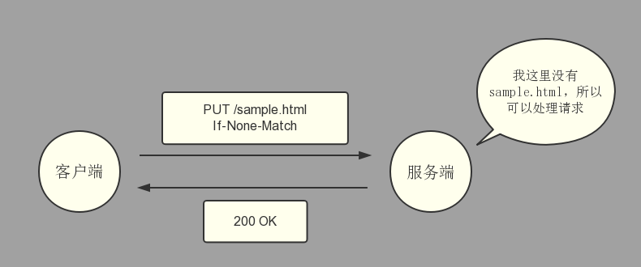

典型的头部属性使用 `X-` 作为前缀，但是这条规则在2012年就被弃用了，因为当一些不标准的的字段变为 RFC 6648 中的标准，以及其他一些先前被定义在 RFC 4229 中的字段被列在 IANA 注册表中时，这条规则造成了不便。IANA 也在维护一个提出新的 HTTP 信息头部的注册表。

HTTP 头部可以根据他们的上下文分为4种

- 一般头部

  适用于所有的请求和响应，但是与数据（尤其的主体中传输的数据）无关

- 请求头部

  包含更多关于将要被获取的资源或者客户端本身的信息

- 响应头部

  带有关于响应的额外的（比如他的位置）或者服务端本身（名字，版本等等）的信息

- 实体头部

  包含更多关于实体的主体部分（比如实体长度或者他的 MIME 类型）信息

也可以根据代理如何处理他们来分类

- End-to-End 头部

  这些头部必须传输到信息的最终接收者，就是请求的服务端或响应的客户端。中间代理必须继续传输未修改的 End-to-End 头部，并且缓存必须存储他们

- Hop-by-Hop 头部

  这些头部仅仅对单一的传输层连接有意义，并且不能被代理或缓存继续传输。这些头部有：`Connection` , `Keep-Alive` , `Proxy-Authenticate` , `Proxy-Authorization` , `TE` , `Trailer` , `Transfer-Encoding` 和 `Upgrade`

---

### HTTP/1.1 首部字段

**通用首部**

|    首部字段名     |            说明            |
| :---------------: | :------------------------: |
|   Cache-Control   |       控制缓存的行为       |
|    Connection     |    逐跳首部、连接的管理    |
|       Date        |     创建报文的日期时间     |
|      Pragma       |          报文指令          |
|      Trailer      |     报文末端的首部一览     |
| Transfer-Encoding | 指定报文主体的传输编码方式 |
|      Upgrade      |       升级为其他协议       |
|        Via        |    代理服务器的相关信息    |
|      Warning      |          错误通知          |

**请求首部**

|     首部字段名      |                      说明                       |
| :-----------------: | :---------------------------------------------: |
|       Accept        |            用户代理可处理的媒体类型             |
|   Accept-Charset    |                  优先的字符集                   |
|   Accept-Encoding   |                 优先的内容编码                  |
|   Accept-Language   |             优先的语言（自然语言）              |
|    Authorization    |                  Web 认证信息                   |
|       Expect        |              期待服务器的特定行为               |
|        From         |               用户的电子邮箱地址                |
|        Host         |               请求资源所在服务器                |
|      If-Match       |              比较实体标记（ETag）               |
|  If-Modified-Since  |               比较资源的更新时间                |
|    If-None-Match    |         比较实体标记（与If-Match相反）          |
|      If-Range       |      资源未更新时发送实体 Byte 的范围请求       |
| If-Unmodified-Since | 比较资源的更新时间（与 If-Modified-Since 相反） |
|    Max-Forwards     |                 最大传输逐调数                  |
| Proxy-Authorization |         代理服务器要求客户端的认证信息          |
|        Range        |               实体的字节范围请求                |
|       Referer       |            对请求中 URI 的原始获取方            |
|         TE          |                传输编码的优先级                 |
|     User-Agent      |              HTTP 客户端程序的信息              |

**响应首部**

|     首部字段名     |             说明             |
| :----------------: | :--------------------------: |
|   Accept-Ranges    |     是否接收字节范围请求     |
|        Age         |     推算资源创建经过时间     |
|        ETag        |        资源的匹配信息        |
|      Location      |   令客户端重定向至指定 URI   |
| Proxy-Authenticate | 代理服务器对客户端的认证信息 |
|    Retry-After     |   对再次发起请求的时机要求   |
|       Server       |    HTTP 服务器的安装信息     |
|        Vary        |   代理服务器缓存的管理信息   |
|  WWW-Authenticate  |   服务器对客户端的认证信息   |

**实体首部**

|    首部字段名    |             说明             |
| :--------------: | :--------------------------: |
|      Allow       |    资源可支持的 HTTP 方法    |
| Content-Encoding |    实体主体适用的编码方式    |
| Content-Language |      实体主体的自然语言      |
|  Content-Length  | 实体主体的大小（单位：字节） |
| Content-Location |      替代对应资源的 URI      |
|   Content-MD5    |      实体主体的报文摘要      |
|  Content-Range   |      实体主体的位置范围      |
|   Content-Type   |      实体主体的媒体类型      |
|     Expires      |    实体主体过期的日期时间    |
|  Last-Modified   |    资源的最后修改日期时间    |

**非HTTP/1.1 首部字段**

**`Cookie` , `Set-Cookie` , `Content-Disposition`**

#### 按使用类别分类

|     类别     |              字段名              |
| :----------: | :------------------------------: |
|   身份验证   |                                  |
|              |         WWW-Authenticate         |
|              |          Authorization           |
|              |        Proxy-Authenticate        |
|              |       Proxy-Authorization        |
|     缓存     |                                  |
|              |               Age                |
|              |          Cache-Control           |
|              |             Expires              |
|              |              Prama               |
|              |             Warning              |
|  客户端提示  |                                  |
|              |            Accept-CH             |
|              |        Accept-CH-Lifetime        |
|              |           Content-DPR            |
|              |               DPR                |
|              |             Downlink             |
|              |            Save-Data             |
|              |          Viewport-Width          |
|     条件     |                                  |
|              |          Last-Modified           |
|              |               ETag               |
|              |             If-Match             |
|              |          If-None-Match           |
|              |        If-Modified-Since         |
|              |       If-Unmodified-Since        |
|   连接管理   |                                  |
|              |            Connection            |
|              |            Keep-Alive            |
|   内容协商   |                                  |
|              |              Accept              |
|              |          Accept-Charset          |
|              |         Accept-Encoding          |
|              |         Accept-Language          |
|     控制     |                                  |
|              |              Expect              |
|              |           Max-Forwards           |
|   Cookies    |                                  |
|              |              Cookie              |
|              |            Set-Cookie            |
|              |             Cookie2              |
|              |           Set-Cookie2            |
|     CORS     |                                  |
|              |   Access-Control-Allow-Origin    |
|              | Access-Control-Allow-Credentials |
|              |   Access-Control-Allow-Headers   |
|              |   Access-Control-Allow-Methods   |
|              |  Access-Control-Expose-Headers   |
|              |      Access-Control-Max-Age      |
|              |  Access-Control-Request-Headers  |
|              |  Access-Control-Request-Method   |
|              |              Origin              |
|              |       Timing-Allow-Origin        |
| Do Not Track |                                  |
|              |               DNT                |
|              |                TK                |
|     下载     |                                  |
|              |       Content-Disposition        |
| 消息主体信息 |                                  |
|              |          Content-Length          |
|              |           Content-Type           |
|              |         Content-Encoding         |
|              |         Content-Laguage          |
|              |         Content-Location         |
|     代理     |                                  |
|              |            Forwarded             |
|              |         X-Forwarded-For          |
|              |         X-Forwarded-Host         |
|              |        X-Forwarded-Proto         |
|              |               Via                |
|    重定向    |                                  |
|              |             Location             |
|  请求上下文  |                                  |
|              |               From               |
|              |               Host               |
|              |             Referer              |
|              |          Referer-Policy          |
|              |            User-Agent            |
|  响应上下文  |                                  |
|              |              Allow               |
|              |              Server              |
|   请求范围   |                                  |
|              |          Accept-Ranges           |
|              |              Range               |
|              |             If-Range             |
|              |          Content-Range           |

|      类别       |               字段名                |
| :-------------: | :---------------------------------: |
|      安全       |                                     |
|                 |       Content-Security-Policy       |
|                 | Content-Security-Policy-Report-Only |
|                 |              Expect-CT              |
|                 |           Public-Key-Pins           |
|                 |     Public-Key-Pins-Report-Only     |
|                 |      Strict-Transport-Security      |
|                 |      Upgrade-Insecure-Requests      |
|                 |       X-Content-Type-Options        |
|                 |         X-Download-Options          |
|                 |           X-Frame-Options           |
|                 |  X-Permitted-Cross-Domain-Policies  |
|                 |            X-Powered-By             |
|                 |          X-XSS-Protection           |
| 服务端发送事件  |                                     |
|                 |              Ping-From              |
|                 |               Ping-To               |
|                 |            Last-Event-ID            |
| Transfer coding |                                     |
|                 |          Transfer-Encoding          |
|                 |                 TE                  |
|                 |               Trailer               |
|    WebSockt     |                                     |
|                 |          Sec-WebSocket-Key          |
|                 |      Sec-WebSocket-Extensions       |
|                 |        Sec-WebSocket-Accept         |
|                 |       Sec-WebSocket-Protocol        |
|                 |        Sec-WebSocket-Version        |
|      其他       |                                     |
|                 |                Date                 |
|                 |              Expect-CT              |
|                 |          Large-Allocation           |
|                 |                Link                 |
|                 |             Retry-After             |
|                 |            Server-Timing            |
|                 |              SourceMap              |
|                 |               Upgrade               |
|                 |                Vary                 |
|                 |       X-DNS-Prefetch-Control        |
|                 |           X-Firefox-Spdy            |
|                 |          X-Requested-With           |
|                 |            X-Robots-Tag             |
|                 |           X-UA-Compatible           |


---

### 通用首部

**Cache-Control**

指定请求或相应的缓存机制指令

```h
Cache-Control: private, max-age=0, no-cache
```

- 缓存请求指令

  |       指令       |  参数  |             说明             |
  | :--------------: | :----: | :--------------------------: |
  |     no-cache     |   无   |    强制向源服务器再次验证    |
  |     no-store     |   无   |  不缓存请求或响应的任何内容  |
  |   max-age=[秒]   |  必需  |      响应的最大 Age 值       |
  | max-stale(=[秒]) | 可省略 |       接收已过期的响应       |
  |  min-fresh=[秒]  |  必需  | 期望在指定时间内的响应仍有效 |
  |   no-transform   |   无   |     代理不可更改媒体类型     |
  |  only-if-cached  |   无   |        从缓存获取资源        |
  | cache-extension  |   -    |     新指令标记（token）      |

- 缓存响应指令

  |      指令       |  参数  |                      说明                      |
  | :-------------: | :----: | :--------------------------------------------: |
  |     public      |   无   |            可向任意方提供响应的缓存            |
  |     private     | 可省略 |              仅向特定用户返回响应              |
  |    no-cache     | 可省略 |            缓存前必须先确认其有效性            |
  |    no-store     |   无   |           不缓存请求或响应的任何内容           |
  |  no-transform   |   无   |              代理不可更改媒体类型              |
  | must-revalidate |   无   | 要求中间缓存服务器对缓存的响应有效性再进行确认 |
  |  max-age=[秒]   |  必需  |               响应的最大 Age 值                |
  |  s-maxage=[秒]  |  必需  |        公共缓存服务器响应的最大 Age 值         |
  | cache-extension |   -    |              新指令标记（token）               |

表示是否可缓存

- public：表明其他用户也可利用缓存

  ```
  Cache-Control: public
  ```

- private：只对特定用户提供资源缓存的服务

  ```
  Cache-Control: private
  ```

- no-cache：防止从缓存中返回过期的资源

  ```
  Cache-Control: no-cache
  ```

  - 如果客户端的请求包含 `no-cache` 指令，客户端将不会接收缓存过的响应，中间的缓存服务器必须把请求转发给源服务器
  - 如果服务器返回的响应包含 `no-cache` 指令，则缓存服务器不能对资源进行缓存，源服务器以后也将不再对缓存服务器请求中提出的资源有效性进行确认

  ```
  Cache-Control: no-cache=Location
  ```

  - 如果响应中 `no-cache` 有参数值，则客户端接收到该响应报文后，就不能使用缓存。只能在响应指令中指定该参数

控制可执行缓存的对象的指令

- no-store：请求（和对应的响应）或响应中包含机密信息，因此不能在本地缓存请求或响应的任一部分

  ```
  Cache-Control:no-store
  ```

指定缓存期限和认证的指令

- s-maxage：功能与 `max-age` 相同，但 `s-maxage` 只适用于供多位用户使用的公共缓存服务器，否则指令无效，当使用 `s-maxage` 时，则忽略对 `Expires` 首部字段及 `max-age` 指令的处理

  ```
  Cache-Control: s-maxage=604800(单位：秒)
  ```

- max-age：资源保存为缓存的最长时间

  ```
  Cache-Control: max-age=604800(单位：秒)
  ```

  - 为 0 时，则缓存服务器通常需要将请求转发给源服务器
  - 缓存资源的缓存时间比指定时间小，则客户端接收缓存资源
  - 响应中包含 `max-age` 时，缓存服务器不再对资源有效性作确认
  - HTTP/1.1 版本中，若与 `Expires` 首部字段一起使用，优先处理 `max-age` 指令，而 HTTP/1.0 版本则相反

- min-fresh：要求缓存服务器返回至少还未过指定时间的缓存资源

  ```
  // 在这 60 秒内如果有超过有效期限的资源都无法作为响应返回
  Cache-Control: min-fresh=60(单位：秒)
  ```

- max-stale：缓存资源即使过期也照常接收

  ```
  Cache-Control: max-stale=3600(单位：秒)
  ```

  - 如果未指定参数值，则无论过期多久，照常接收
  - 如果指定参数值，即使过期，只要仍处于 `max-stale` 指定的时间内，照常接收

- only-if-cached：表示客户端仅在缓存服务器本地缓存目标资源的情况下才会要求其返回

  ```
  Cache-Control: only-if-cached
  ```

  - 缓存服务器不重新加载响应，也不会再次确认资源有效性
  - 若请求缓存服务器的本地缓存无响应，则返回 `504 Gateway Timeout`

- must-revalidate

- proxy-revalidate

- no-transform

Cache-Control 扩展

- cache-extension token

  ```
  Cache-Control: private, community="UCI"
  ```

**Connection**

控制在当前事务完成后该网络连接是否保持打开状态

- 控制不再转发给代理的首部字段（即 hop-by-hop 首部）

  ```
     (客户端)
  GET / HTTP/1.1                                                   (服务端)
  Upgrade: HTTP/1.1      --->         代理         --->         GET / HTTP/1.1
  Connection: Upgrade
  ```

- 管理持久连接

  - HTTP/1.1 的默认连接是持久连接

    ```
                               GET / HTTP/1.1
                               Connection: Keep-Alive
                     ------------------------------------------>
    客户端                                                                 服务端
                     <------------------------------------------
                               HTTP/1.1 200 OK
                               ...
                               Keep-Alive: timeout=10, max=500
                               Connection: Keep-Alive
    ```

  - 服务器明确想断开

    ```
    Connection: close
    ```

- HTTP/1.1 之前的版本的默认连接都是非持久连接

**Date**

创建 HTTP 报文的日期与时间

```
// HTTP/1.1 版本的格式
Date: Tue, 28 Feb 2018 00:00:00 GMT

// 之前的版本的格式
Date: Tue, 28-Feb-18 00:00:00 GMT

// 另外一种，与 C 标准库的 asction() 输出格式一样
Date: Tue Feb 28 00:00:00 2018
```

**Prama**

特定实现的请求头，在请求相应链中的任何位置可能有各种各样的效果。要求所有的中间服务器不返回缓存的资源，向后兼容 HTTP/1.0 缓存，而那时 `Cache-Control` 还不存在

```
Pragma: no-cache
```

如果所有的中间服务器都以 HTTP/1.1 为基准，则直接采用 `Cache-Control: no-cache`，否则一般都会同时使用下面两个首部字段

```
Cache-Control: no-cache
Pragma: no-cache
```

**Trailer**

事先说明报文主体后记录了哪些首部字段，可应用于 HTTP/1.1 版本分块传输编码

```
HTTP/1.1 200 OK
Date: Tue, 28 Feb 2018 00:00:00 GMT
Content-Type: text/html
...
Transfer-Encoing: chunked
Trailer: Expires

...(报文主体)...
0
Expires: Tue, 28 Feb 2018 11:11:11 GMT
```

**Transfer-Encoding**

规定了传输报文主体采用的编码方式，HTTP/1.1 传输编码方式仅对分块传输编码有效

```
HTTP/1.1 200 OK
Date: Tue, 28 Feb 2018 00:00:00 GMT
Cache-Control: public, max-age=604800
Content-Type: text/javascript; charset=utf-8
Expires: Tue, 28 Feb 2018 11:11:11 GMT
X-Frame-Options: DENY
X-XSS-Protection: 1; mode=block
Content-Encoding: gzip
Transfer-Encoding: chunked
Connection: keep-alive

cf0     <---- 16进制(10进制为3312)

...3312 字节分块数据...

392     <---- 16进制(10进制为914)

...914 字节分块数据...

0
```

如上所示，使用分块传输编码，且被分为 3312 字节和 914 字节大小的分块数据

**Upgrade**

**Via**

由代理（正向和反向代理）添加，追踪客户端与服务器之间的请求和响应报文的传输路径。与 traceroute 及电子邮件的 Received 首部的工作机制类似

```
                                                                   GET / HTTP/1.1
                                    GET / HTTP/1.1                 Via: 1.0 example.com，
       GET / HTTP/1.1               Via: 1.0 example.com                1.1 test.com
客户端 ----------------> 代理服务器A ------------------> 代理服务器B ----------------> 源服务器
```

**Warning**

一般情况下，包含可能出现的与缓存相关的问题的信息

```
// 格式
Warning: [警告码][警告的主机:端口号]"[警告的内容]"([日期时间<可选>])

// 举例
Warning: 113 example.com:8080 "Heuristic expiration" Tue, 28 Feb => 2018 00:00:00 GMT
```

HTTP/1.1 定义了7种警告

| 警告码 |                     警告内容                     |                             说明                             |
| :----: | :----------------------------------------------: | :----------------------------------------------------------: |
|  110   |         Response is stale（响应已过期）          |                     代理返回已过期的资源                     |
|  111   |        Revalidation failed（再验证失败）         |       代理再验证资源有效性失败（服务器无法到达等原因）       |
|  112   |     Disconnection operation（断开连接操作）      |                  代理与互联网连接被故意切断                  |
|  113   |        Heuristic expiration（试探性过期）        | 响应的使用期超过24小时（有效缓存的设定时间大于24小时的情况下） |
|  199   |        Miscellaneous warning（杂项警告）         |                        任意的警告内容                        |
|  214   |       Transformation applied（使用了转换）       |          代理对内容编码或媒体类型等执行了某些处理时          |
|  299   | Miscellaneous persistent warning（持久杂项警告） |                        任意的警告内容                        |

---

### 请求首部

**Accept**

告知服务端用户代理能够处理的媒体类型及相对优先级，即 MIME(Multipurpose Internet Mail Extensions)

```
Accept: text/html, application/xhtml+xml, application/xml;q=0.9, */*;q=0.8
```

媒体类型

- 文本文件

  ```
  text/html, text/plain, text/css ...
  application/xhtml+xml, application/xml ...
  ```

- 图片文件

  ```
  image/jpeg, image/gif, image/png ...
  ```

- 视频文件

  ```
  video/mpeg, video/quicktime ...
  ```

- 应用程序使用的二进制文件

  ```
  application/octet-stream, application/zip ...
  ```

使用 **`q=[权重(0~1)]`** 表示优先级，不指定则默认为 `q=1.0`；当服务端提供多种内容时，首先返回权重值最高的内体类型；也可使用 **`*`** 作为通配符，指定任何类型

**Accept-Charset**

告知服务端用户代理支持的字符集以及相对优先顺序，同样使用 **`q`** 表示优先级，也可使用 **`*`**

```
Accept-Charset: iso-8859-5, unicode-1-1;q=0.8
```

**Accept-Encoding**

告知服务端用户代理支持的编码及优先级，同样使用 **`q`** 表示优先级，也可使用 **`*`**

```
Accept-Encoding: gzip, deflate
```

编码类型

- gzip

  由文件压缩程序 gzip （GNU zip）生成的编码格式，采用 Lempel-Ziv 算法（LZ77）及 32 位循环冗余校验（CRC）

- compress

  由 UNIX 文件压缩程序 compress 生成的编码格式，采用 Lempel-Ziv-Welch 算法（LZW）

- deflate

  组合使用 zlib 格式及由 deflate 压缩算法生成的编码格式

- identity

  不执行压缩或不会变化的默认编码格式

**Accept-Language**

告知服务器用户代理能够处理的自然语言集（中文或英文等）及优先级，同样使用 **`q`** 表示优先级，也可使用 **`*`**

```
Accept-Language: zh-cn,zh;q=0.7, en-us,en;q=0.3
```

**Authorization**

告知服务器用户代理的认证信息（证书值）。通常情况下，用户代理收到 401 状态码的响应后，把 Authorization 加入请求中


**Expect**

告知服务器期望出现的某种特定行为，当服务器无法理解客户端的期望做出回应而发生错误时，会返回状态码 417 Expectation Failed

等待状态码 100 响应的客户端发生请求时，需指定：

```
Expect: 100-continue
```

**From**

告知服务器使用用户代理的用户的电子邮件地址，通常是为了显示联系方式。使用代理时，尽可能使用该字段。（有时因代理不同，将电子邮件地址记录在 `User-Agent` 首部字段内）

```
From: example@gmail.com
```

**Host**

告知服务器请求的资源所处的互联网主机名和端口号。HTTP/1.1 中，Host 是唯一一个必须被包含在请求内的首部字段

同一个 IP 地址可能部署运行多个域名，所以 Host 就是为了明确指出请求的主机名。若服务器未设定主机名，直接发送空值即可，即 `Host:`

```
Host: www.example.com
```

**If-Match**

附带条件之一，告知服务器匹配资源所用的实体标记（ETag）值。如果使用 **`*`** 作为值，服务器将忽略 ETag 的值，只要资源存在便处理请求

```
If-Match: "123456"
```

服务器会比对 `If-Match` 的字段值和资源的 `ETag` 值，两者一致才处理请求，否则返回状态码 412 Precondition Failed 的响应


**If-Modified-Since**

用于确认代理或客户端拥有的本地资源的有效性。`Last-Modified` 可以确定资源的更新时间

如果请求的资源在 `If-Modified-Since` 之后都没有更新过，就返回 304 Not Modified 的响应


**If-None-Match**

附加条件之一，与 `If-Match` 作用相反，当该字段指定值的实体标记 （ETag）值与请求资源的 `ETag` 不一致时，告知服务器处理该请求。这用于请求更新缓存（用于安全请求），或者在资源已经存在时避免防止上传新资源

在 `GET` 或 `HEAD` 方法中使用该字段可获取最新的资源



**If-Range**

该字段值若与 `ETag` 值或更新的日期时间相匹配，便作为范围请求处理，若不一致，则返回全体资源


**If-Unmodified-Since**

告知服务器，指定的请求资源只有在字段值内指定的时间之后未发生改变的情况下，才处理请求，若发生了更新，则返回状态码 412 Precondition Failed 的响应。与 `If-Modified-Since` 作用相反

```
If-Unmidified-Since: Tue, 28 Feb 2018 00:00:00 GMT
```

**Max-Forwards**

```
Max-Forwards: 2       Max-Forwards: 1       Max-Forwards: 0
    客户端      --->     代理服务器 A   --->    代理服务器 B    --->    源服务器
                                              (直接返回响应)
```

通过 TRACE 方法或 OPTIONS 方法，该字段指定可经过的服务器的最大数目。每次转发数值都会减一。当服务器收到该值为 0 的请求时，则不再进行转发，直接返回响应

```
Max-Forwards: 10
```

**Proxy-Authorization**

接收到从代理服务器发来的认证质询时，客户端发送包含该字段的请求，以告知服务端认证所需的信息

```
Proxy-Authorization: Basic dGowrqoweqnmzckljq
```

该字段用于客户端与代理之间的认证，而客户端与服务器之间的认证，则使用 `Authorization`

**Range**

告知服务端请求的资源的指定范围

```
Range: bytes=5001-10000
```

服务端处理完请求后返回状态码为 206 Partial Content 的响应，若无法处理，则返回包含 200 OK 状态码以及全部资源的响应

**Referer**

告知服务端请求的原始资源的 URI

```
Referer: http://www.example.com/index.html
```

处于安全考虑，也可不发送该字段，因为可能带有 ID 和密码等保密信息

另外，正确拼写应该是 Referrer，但是却一直沿用错误的写法

**TE**

告知服务端客户端能处理响应的传输编码方式及相对优先级，跟 `Accept-Encoding` 功能类似，但是用于传输编码

```
TE: gzip, deflate;q=0.5
```

除了指定传输编码外，还可以指定伴随 `trailer` 字段的分块传输编码，应用后者时，赋值为 trailers 即可

```
TE: trailers
```

**User-Agent**

告知服务端创建请求的浏览器和用户代理名称等信息

如果是网络爬虫发起的请求，可能会在字段内添加爬虫作者的电子邮件，如果经过代理，中间可能添加代理服务器的名称

```
User-Agent: Mozilla/5.0 (Windows NT 6.1; WOW64; rv:13.0) Gecko/=>20100101 Firefox/13.0.1
```

---

### 响应首部

用于补充响应的附加信息，服务器信息，以及对客户端的附加要求等信息

**Accept-Ranges**

告知客户端服务端是否能处理范围请求，以指定获取服务端某个部分的资源，两种值：bytes，none

```
Accept-Ranges: bytes
```

**Age**

告知客户端服务端多久前创建了该响应，单位为秒

```
Age: 600
```

若创建该响应的服务端是缓存服务器，则 `Age` 指缓存后的响应再次发起认证到认证完成的时间，代理创建响应时必须加上字段 `Age`

**ETag**

实体标记，与特定资源关联的确定值，将资源以字符串形式做唯一性标识。资源更新后 `ETag` 也随之更新，没有统一的算法，仅由服务器来分配。使用 `If-Match` 和 `If-None-Match` 的请求使用该字段来改变请求的行为

```
ETag: "12983ba223483c098342d12789324e5"
```

相同的 URI 资源可能不同，比如英文版的页面与中文版的页面。如页面加载过程中出现连接中断、再连接的情况，都会依照 `ETag` 值来指定资源

- 强 ETag

  不论实体发生多么细微的变化都会改变其值

  ```
  ETag: "usagi-1234
  ```

- 弱 ETag

  只用于提示资源是否相同，只有资源发生了根本变化，产生差异时才改变其值。此时，会在字段值开头附加 W/

  ```
  ETag: W/"usagi-1234"
  ```

**Location**

将客户端引导至某个与请求 URI 位置不同的资源

```
Location: http://www.example.com/another.html
```

一般会配合 3xx Redirection 的响应，提供重定向 URI

几乎所有的浏览器接收到包含该字段的响应后，都会强制性地尝试对已提示的重定向资源的访问

**Proxy-Authenticate**

把由代理服务器所要求的认证信息发给客户端

```
Proxy-Authenticate: Basic realm="Usagidesign Auth"
```

与客户端与服务端的认证类似，但是它们进行认证时，使用的是字段 `WWW-Authorization`

**Retry-After**

告知客户端多久之后再发送请求，主要配合状态码 503 Service Unavailable 响应，或 3xx Redirection 响应一起使用

```
Retry-After: 120
```

可指定具体的日期时间，也可以是创建响应后的秒数

**Server**

告知客户端当前服务端上安装的 HTTP 服务器应用程序的信息，包括应用名称，版本号和安装时启用的可选项等

```
Server: Apache/2.2.6 (Unix) PHP/5.2.5
```

**Vary**

**WWW-Authenticate**

定义获取资源访问权应该使用的身份验证方法

---

### 实体首部

**Allow**

**Content-Encoding**

用于指定压缩算法

**Content-Language**

指示主体使用的语言

**Content-Length**

指示发送给接受者的实体主体大小

**Content-Location**

指示返回数据的备用地址

**Content-Type**

指示资源类型

**Content-Range**

**Expires**

相应的过期时间

**Last-Modified**

验证器，资源的最后修改时间，用来比较同一资源的几个版本。没有 `ETag` 准确，但是在一些环境下更容易计算。使用 `If-Modified-Since` 和 `If-Unmodified-Since` 的请求使用这个字段来改变请求的行为

---

### 连接管理

**Keep-Alive**

控制持久连接应该保持打开状态多长时间

---

### Cookies

**Cookie**

包含先前服务端发送的带有 `Set-Cookie` 头部存储的 HTTP cookies

**Set-Cookie**

从服务端发送 cookies 到用户代理

**Cookie2**

用于包含先前服务端发送的带有 `Set-Cookie` 头部的 HTTP cookie，但已被规范弃用。替换为 `Cookie` 

**Set-Cookie2**

用于将 cookies 从服务端发送到用户代理，但已被规范弃用。替换为 `Set-Cookie`

---

###CORS

**Access-Control-Allow-Origin**

表明所请求的资源是否接受来自指定 origin 的请求

**Access-Control-Allow-Credentials**

指示当 `Credential` 标志为 true 时，响应是否可以被得到

**Access-Control-Allow-Headers**

在响应预检请求时使用，以指示在发出实际请求时可以使用哪些请求头

**Access-Control-Allow-Methods**

指定访问资源时允许使用的方法

**Access-Control-Expose-Headers**

通过罗列他们的名字来指示响应请求头字段的白名单

**Access-Control-Max-Age**

指示请求的结果能缓存多长时间

**Access-Control-Request-Headers**

在发出预检请求时使用，以便在发出实际请求时让服务端知道将使用哪个 HTTP 头部

**Access-Control-Request-Method**

在发出预检请求时使用，以便在发出实际请求时让服务端知道将使用哪个 HTTP 方法

**Origin**

指示获取的来源

**Time-Allow-Origin**

指定允许通过 [Resource Timing API](https://developer.mozilla.org/en-US/docs/Web/API/Resource_Timing_API) 的特性查看属性值的原点，否则由于跨域限制，将其报告为零

---

### Do Not Track

**DNT**

用于表示用户的跟踪偏好

**TK**

指示应用于相应请求的跟踪状态

---

### 下载

**Content-Disposition**

响应头部，如果传输的资源应以内联方式显示（标题不存在时的默认行为），或者应该像下载一样处理，浏览器应显示“另存为”窗口

---

### Proxies

**Forwarded**

包含来自代理服务器面向客户端的信息，当代理涉及到请求路径时，这些信息将被修改或丢失

**X-Forwarded-For**

标识通过 HTTP 代理或负载均衡器连接到 web 服务器的客户端的原始 IP 地址

**X-Forwarded-Host**

标识用于连接到代理或负载均衡器的客户端请求的原始主机

**X-Forwarded-Proto**

标识客户端连接到代理或负载均衡器的协议（HTTP 或 HTTPS）

---

### 参考

- [MDN - HTTP headers](https://developer.mozilla.org/en-US/docs/Web/HTTP/Headers)
- [理解 CORS (Cross-Origin Resource Sharing)](http://huang-jerryc.com/2016/05/15/%E7%90%86%E8%A7%A3%20CORS%20(Cross-Origin%20Resource%20Sharing)/)