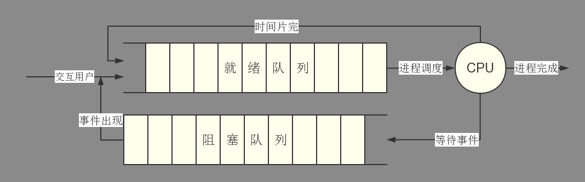
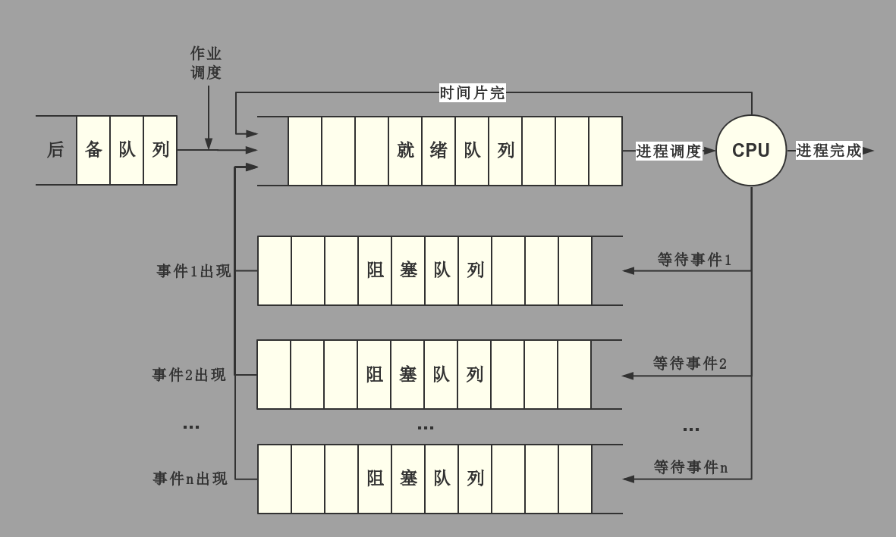
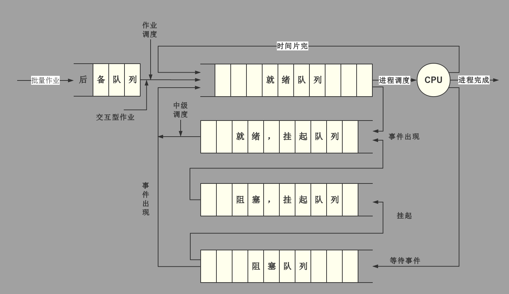

### 调度队列模型

**仅有进程调度**

就绪进程呈 FIFO 队列形式，每当 OS 创建一个进程，便挂在队列末尾，按时间片轮转方式进行

**具有高级和低级调度**

**具有三级调度**

### 调度准则

**面向用户**

- 周转事件短

  周转时间，是指从作业被提交给系统开始，到作业完成为止的这段时间间隔，包括

  - 作业在外存后备队列等待调度的时间
  - 进程在就绪队列上等待进程调度的时间
  - 进程在 CPU 上执行的时间
  - 进程等待 I/O 操作完成的时间

- 响应时间快

  响应时间，是从用户通过键盘提交一个请求开始，直至系统首次产生响应为止的时间，或者说，直到屏幕上显示出结果为止的一段时间间隔，包括

  - 从键盘输入的请求信息传送到处理机的时间
  - 处理机对请求信息进行处理的时间
  - 将相应信息回送到终端显示器的时间

- 截止时间的保证

  截止时间，是指某任务必须开始执行的最迟时间，或必须完成的最迟时间

- 优先权准则

  使某些紧急的作业能得到及时处理

**面向系统**

- 系统吞吐量高

  吞吐量，是指在的单位时间内系统所完成的作业数

- 处理机利用率好

  调度方式和算法对处理机的利用率有十分重要的作用

- 各类资源的平衡利用

